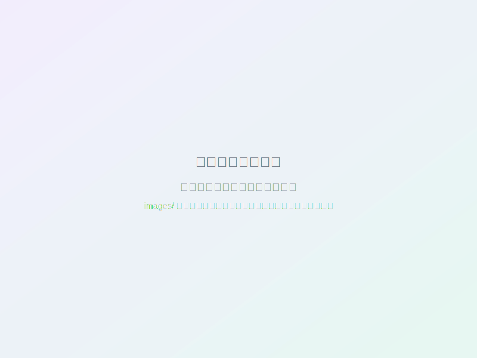

# UIデザイナー ポートフォリオサイト

2つの作品（シフト管理アプリ、カフェHP）を掲載したUIデザイナーのポートフォリオサイトです。サイバーエージェントUIデザイナー選考課題用に作成されました。

## 📌 プロジェクト概要

このポートフォリオサイトは、「シフト入力とアラーム設定が連動するアプリ」の設計思想と実装を、論理的かつ情熱的に伝えるために構築されました。

### 主要な特徴

- ✨ **モダンでクリーンなデザイン** - 白ベースに紫とグリーンのアクセントカラー
- 📱 **完全レスポンシブ対応** - モバイル、タブレット、デスクトップ全てに最適化
- 🎭 **スムーズなアニメーション** - スクロール連動のフェードイン/スライドアップ効果
- 🖼️ **インタラクティブなスライダー** - 作品画像を効果的に表示
- ⚡ **高速パフォーマンス** - 最適化されたコードとCDN利用

## 🎨 デザインコンセプト

### カラーパレット

```css
--primary-purple: #8B5CF6  /* メインアクセント */
--primary-green: #10B981   /* セカンダリアクセント */
--dark-bg: #0F172A         /* ダークセクション背景 */
--light-bg: #F8FAFC        /* ライトセクション背景 */
```

### タイポグラフィ

- **日本語**: Noto Sans JP
- **英語**: Inter
- レスポンシブなフォントサイズとウェイト

## 📂 ファイル構成

```
portfolio-site/
├── index.html              # メインHTMLファイル
├── css/
│   └── style.css          # メインスタイルシート
├── js/
│   └── main.js            # JavaScriptインタラクション
├── images/
│   └── placeholder.svg    # プレースホルダー画像
└── README.md              # このファイル
```

## 🚀 使用方法

### 1. ローカルで確認

```bash
# プロジェクトディレクトリに移動
cd portfolio-site

# ローカルサーバーを起動（方法1: Python）
python -m http.server 8000

# ローカルサーバーを起動（方法2: Node.js）
npx http-server

# ブラウザで開く
open http://localhost:8000
```

### 2. 画像の差し替え方法

**重要**: シフト管理アプリのスライダーにはプレースホルダー画像が使用されています。実際の作品画像に差し替えてください。

以下のファイル名で `images/` フォルダに画像を配置してください：

**シフト管理アプリ（5枚）:**
1. `calendar-main.jpg` - カレンダー画面
2. `register.jpg` - 新規登録画面
3. `settings.jpg` - 設定画面
4. `calendar-detail.jpg` - カレンダー詳細
5. `shift-detail.jpg` - シフト詳細表示

**カフェHP（1枚）:**
- `cafe-overview.jpg` - 全体像（✅ 既に配置済み）

画像を配置後、`index.html` 内の以下の部分を更新してください：

```html
<!-- 変更前 -->


<!-- 変更後 -->

```

推奨画像サイズ: **1200 x 900px**（4:3比率）

## 🎯 各セクションの説明

### 1. ヒーローセクション
- キャッチコピーと自己紹介
- グラデーションエフェクト（紫と緑）
- CTAボタン（作品を見る、お問い合わせ）

### 2. Aboutセクション
- デザイナーとしての想いと哲学
- 3つの強み（課題発見力、ユーザー視点、デザイン実装）

### 3. Worksセクション
- **タブ切り替え式**で2つの作品を表示
- **プロジェクト1**: シフト管理アプリ（インタラクティブスライダー付き）
- **プロジェクト2**: カフェHP（実サイトリンク付き）
- 課題、解決策、機能、デザイン意図の詳細説明

### 4. Skillsセクション
- UI/UXデザインツール
- フロントエンド技術
- デザインプロセス
- 思考とマインド

### 5. Contactセクション
- お問い合わせフォーム（バリデーション付き）
- 連絡先情報カード
- SNSリンク

## 💻 技術スタック

### フロントエンド
- **HTML5** - セマンティックマークアップ
- **CSS3** - Flexbox、Grid、アニメーション
- **JavaScript (Vanilla)** - インタラクション実装

### ライブラリ・CDN
- **Google Fonts** - Noto Sans JP、Inter
- **Font Awesome** - アイコンライブラリ

### 主要機能

#### 1. ナビゲーション
- 固定ヘッダー（スクロール時に背景変化）
- モバイルハンバーガーメニュー
- スムーズスクロール

#### 2. 画像スライダー
- 自動スライド（5秒間隔）
- 矢印ボタン操作
- ドットインジケーター
- キーボード操作対応（←→キー）
- マウスホバーで自動スライド停止

#### 3. スクロールアニメーション
- Intersection Observer API使用
- フェードイン/スライドアップ効果
- パフォーマンス最適化

#### 4. コンタクトフォーム
- クライアントサイドバリデーション
- メール形式チェック
- 成功/エラー通知表示
- フォームデータのローカル保存（デモ用）

#### 5. その他
- スクロールトップボタン
- レスポンシブデザイン
- アクセシビリティ対応

## 📱 レスポンシブブレークポイント

```css
/* デスクトップ: 1200px以上 */
/* タブレット: 768px - 1199px */
@media (max-width: 1024px) { ... }

/* モバイル: 767px以下 */
@media (max-width: 768px) { ... }

/* 小型モバイル: 480px以下 */
@media (max-width: 480px) { ... }
```

## 🎨 カスタマイズ方法

### 色の変更

`css/style.css` の `:root` セクションでカラー変数を編集：

```css
:root {
    --primary-purple: #8B5CF6;  /* お好みの色に変更 */
    --primary-green: #10B981;   /* お好みの色に変更 */
}
```

### テキストの編集

`index.html` 内の各セクションのテキストを直接編集してください。

### SNSリンクの更新

フッターとContactセクションのSNSリンクを更新：

```html
<!-- 例: Twitter -->
<a href="https://twitter.com/yourhandle" aria-label="Twitter">
    <i class="fab fa-twitter"></i>
</a>
```

## 🔧 今後の改善点

- [ ] バックエンド連携（お問い合わせフォーム送信）
- [ ] 画像の遅延読み込み最適化
- [ ] ダークモード切り替え機能
- [ ] 多言語対応（英語版）
- [ ] アクセシビリティスコア向上
- [ ] SEO最適化（メタタグ、構造化データ）
- [ ] パフォーマンス計測と最適化
- [ ] Google Analytics連携

## 📊 パフォーマンス

- **初回読み込み**: 高速（CDN使用）
- **インタラクション**: スムーズ（60fps）
- **レスポンシブ**: 全デバイス対応
- **アクセシビリティ**: ARIA属性実装

## 🎨 掲載作品

### 1. シフト管理アプリ
- **課題**: シフト制労働者のアラーム設定の煩わしさ
- **解決**: 自動アラーム算出機能
- **技術**: UI/UXデザイン、情報設計、カラー設計

### 2. カフェ「RISE」Webサイト
- **目的**: ブランディングと集客力向上
- **特徴**: 温かみのあるビジュアルデザイン
- **実サイト**: [https://kensyu.whitesnow.jp/koya_ito/](https://kensyu.whitesnow.jp/koya_ito/)

## 🎓 学習リソース

このプロジェクトで使用した技術の参考リソース：

- [MDN Web Docs](https://developer.mozilla.org/) - HTML/CSS/JavaScript
- [CSS Tricks](https://css-tricks.com/) - CSSテクニック
- [Web.dev](https://web.dev/) - パフォーマンス最適化

## 📝 ライセンス

このプロジェクトは個人ポートフォリオ用です。

## 👤 制作者

UIデザイナー - サイバーエージェント選考課題

## 🚀 デプロイ

### Publish タブを使用した公開

サイトを公開する際は、**Publishタブ**に移動して以下の手順で公開してください：

1. Publishタブを開く
2. 「公開」ボタンをクリック
3. 生成されたURLにアクセス

### 代替デプロイ方法

以下のプラットフォームでも公開可能：

- **GitHub Pages**: 無料、簡単
- **Netlify**: 自動デプロイ、フォーム対応
- **Vercel**: 高速、最適化
- **Firebase Hosting**: Googleのインフラ

## 📞 お問い合わせ

質問やフィードバックがあれば、お気軽にご連絡ください。

---

**最終更新日**: 2026年1月2日
